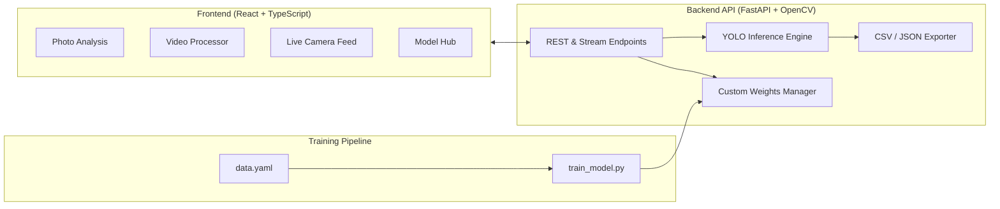

# Object Detection & Custom Model Suite

[](https://www.python.org/)
[](https://fastapi.tiangolo.com/)
[](https://ultralytics.com)
[](https://reactjs.org/)
[](https://www.typescriptlang.org/)
[](https://tailwindcss.com/)
[](LICENSE)

A complete full-stack object detection application built with Python, FastAPI, Ultralytics YOLO, and React. Supports real-time image and video inference, live camera streaming, custom `.pt` model weight uploads, and custom dataset training.

---

## Features

- **Photo Object Detection**: Upload images (`PNG`, `JPG`, `WebP`) with adjustable confidence thresholds and class filtering. View side-by-side comparisons with original photos.
- **Video File Processing**: Upload recorded video clips (`MP4`, `AVI`, `MOV`) for frame-by-frame bounding box annotations and download the processed video.
- **Live Camera Streaming**: Low-latency real-time detection via MJPEG streaming from your webcam with live controls.
- **Custom Model Management**: Switch between standard pre-trained models (`YOLOv8 Nano`, `Small`, `Medium`) or upload custom-trained `.pt` weights directly from the web interface.
- **Data Export**: Export detection results and bounding box coordinates (`x1`, `y1`, `width`, `height`) to **CSV** and **JSON** formats.
- **Custom Training Pipeline**: Ready-to-use Python script (`train_model.py`) to fine-tune YOLO on custom datasets with automated model export.

---

## System Architecture



---

## Getting Started

### Prerequisites

- **Python 3.10+**
- **Node.js 18+** & **npm**

### Quick Start (Windows)

Double-click `start.bat` in the project root to install dependencies and start both backend and frontend servers automatically.

### Manual Setup

#### 1. Backend Setup
```bash
# Navigate to backend directory
cd backend

# Install Python dependencies
pip install -r requirements.txt

# Start FastAPI server
python run.py
```
Backend will be available at `http://localhost:8000`. Interactive API documentation is available at `http://localhost:8000/docs`.

#### 2. Frontend Setup
```bash
# In a new terminal, navigate to frontend directory
cd frontend

# Install npm packages
npm install

# Start development server
npm run dev
```
Web application will open at `http://localhost:5173`.

---

## Project Structure

```
object-detector-pro/
├── backend/
│   ├── app/
│   │   ├── main.py              # FastAPI server & route handlers
│   │   ├── detector.py          # YOLO inference, class filtering & box rendering
│   │   ├── custom_loader.py     # Custom model weights manager
│   │   └── export_utils.py      # CSV and JSON export utilities
│   ├── train/
│   │   ├── train_model.py       # Custom dataset training script
│   │   └── data_template.yaml   # Dataset YAML template
│   ├── models/                  # Stored model weights (.pt)
│   ├── uploads/                 # Uploaded media storage
│   ├── outputs/                 # Annotated output files
│   ├── requirements.txt         # Python dependencies
│   └── run.py                   # Backend entrypoint
│
├── frontend/
│   ├── src/
│   │   ├── components/
│   │   │   ├── Navbar.tsx       # Navigation header
│   │   │   ├── ImageAnalysis.tsx# Photo detection & table inspector
│   │   │   ├── VideoAnalysis.tsx# Video batch processor & player
│   │   │   ├── LiveWebcam.tsx   # Live webcam stream with controls
│   │   │   ├── ModelHub.tsx     # Custom weights manager
│   │   │   └── TrainingGuide.tsx# Custom training workflow guide
│   │   ├── services/api.ts      # Axios API client
│   │   ├── types/index.ts       # TypeScript interfaces
│   │   ├── App.tsx              # Root application layout
│   │   └── main.tsx
│   ├── package.json
│   └── vite.config.ts
│
├── .github/workflows/ci.yml     # GitHub Actions CI build & test workflow
├── LICENSE                      # MIT License
└── start.bat                    # Windows startup script
```

---

## Training a Custom Model

To train the detector on custom object classes:

1. Label your dataset using [Roboflow](https://roboflow.com/) or [CVAT](https://www.cvat.ai/) and export in **YOLOv8 PyTorch** format.
2. Place the dataset directory inside `backend/dataset/`.
3. Configure `backend/train/data_template.yaml` with your class names and paths.
4. Run the training script:
   ```bash
   cd backend/train
   python train_model.py --data data_template.yaml --epochs 40 --name custom_detector
   ```
5. The trained weights (`best.pt`) are automatically saved to `backend/models/` and can be loaded immediately from the **Model Hub** tab in the web interface.

---

## API Endpoints

| Method | Endpoint | Description |
| :--- | :--- | :--- |
| `POST` | `/api/detect/image` | Run object detection on an uploaded image file |
| `POST` | `/api/detect/video` | Process an uploaded video and return annotated file |
| `GET` | `/api/stream/live` | Low-latency MJPEG live webcam stream |
| `POST` | `/api/stream/settings` | Update stream confidence threshold and active class filters |
| `GET` | `/api/models` | List all installed standard and custom models |
| `POST` | `/api/models/select` | Switch the active YOLO model |
| `POST` | `/api/models/upload` | Upload a new custom `.pt` model file |
| `GET` | `/api/health` | Service health status and loaded model info |

---

## License

Distributed under the MIT License. See [`LICENSE`](LICENSE) for more information.

---

## Author

**Shayan Shah** — [GitHub Profile](https://github.com/Shaayan-shah)
